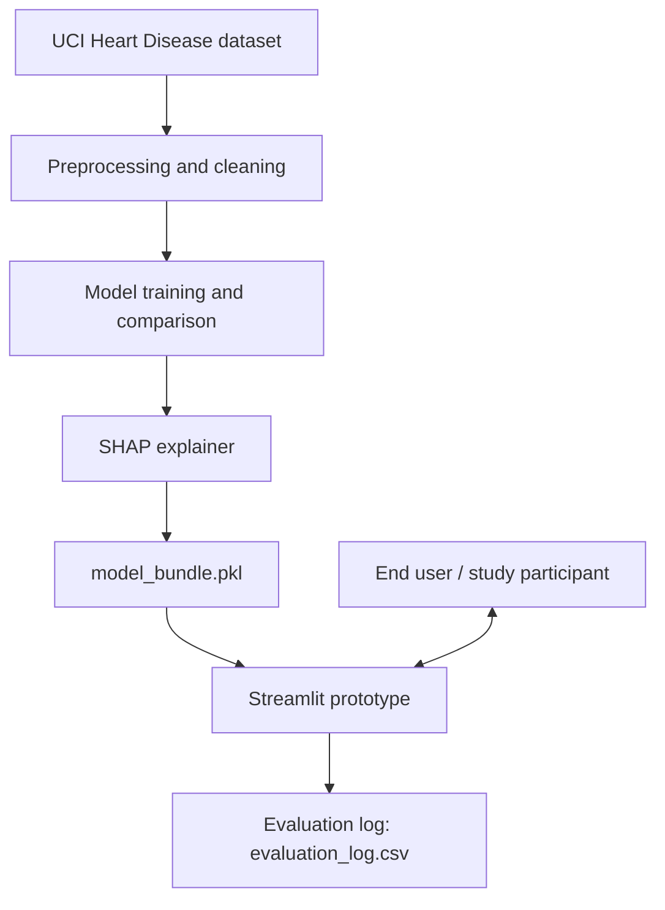

# BSc Project Proposal

**Precursor project for the proposed MSc research direction:**
*Human-Centred Design Frameworks for Explainable AI in Healthcare Applications*

---

## 1. Project Title

**Explainable AI for Heart Disease Risk Prediction: Designing and Evaluating a Human-Centred SHAP Explanation Interface**

*Alternative phrasings you could use depending on department conventions:*
- *A Comparative Study of Visual and Textual Explanation Formats in a Clinical Risk Prediction Prototype*
- *Towards Human-Centred XAI in Healthcare: A SHAP-Based Prototype and Preliminary Usability Study*

---

## 2. Background

Cardiovascular disease remains one of the leading causes of death worldwide, and machine
learning models trained on routinely collected clinical variables (age, blood pressure,
cholesterol, ECG results, etc.) have repeatedly shown they can support early risk
identification. However, the more accurate models in this space — ensembles, boosted
trees, kernel methods — are also the least transparent. This "black box" problem is a
recognised barrier to clinical adoption: clinicians and patients are reasonably reluctant
to act on a prediction they cannot interrogate.

Explainable AI (XAI) methods such as SHAP (SHapley Additive exPlanations) and LIME
address the *technical* half of this problem: they can attribute a model's prediction to
its input features in a mathematically principled way. What is much less well established
is the *human* half — whether the explanations these tools generate are actually
understandable, trusted, and useful to the people who need to act on them. This is
precisely the gap your proposed MSc research (human-centred design frameworks for XAI in
healthcare) sits in.

This BSc project is a deliberately smaller, self-contained step into that space: build a
working risk-prediction model with SHAP explanations, wrap it in an interactive prototype,
and run a small preliminary evaluation of how explanation *format* affects a user's
understanding and trust. It will not produce generalisable clinical findings — it is not
designed to — but it will give you hands-on, defensible evidence of the technical and
methodological skills the MSc will build on.

---

## 3. Problem Statement

Current explainable AI tools for clinical risk prediction are typically evaluated on
technical properties (fidelity to the model, consistency, computational cost) rather than
on whether their output is actually interpretable and trustworthy *to the humans who use
them*. Without this evidence, it is unclear whether a technically correct explanation
(e.g. a SHAP value) translates into a practically useful one. This project investigates,
at small scale, (a) whether an interpretable machine learning pipeline can achieve
competitive predictive performance on a real clinical dataset, and (b) whether the
*format* in which a SHAP-based explanation is presented (visual chart vs. plain-language
text) measurably affects a lay user's self-reported understanding and trust.

---

## 4. Aim

> To design, implement, and evaluate a small-scale explainable AI prototype for heart
> disease risk prediction that produces SHAP-based explanations, and to conduct a
> preliminary human-centred usability evaluation comparing two explanation presentation
> formats.

---

## 5. Objectives

1. **O1 —** Acquire, clean, and document a reproducible preprocessing pipeline for the
   UCI Heart Disease dataset.
2. **O2 —** Train and compare at least three classification models (Logistic Regression,
   Random Forest, Gradient Boosting, and/or SVM), reporting accuracy, precision, recall,
   F1-score, and ROC-AUC on a held-out test set.
3. **O3 —** Implement a SHAP-based explanation module producing both global
   (dataset-level) and local (single-prediction) explanations for the best-performing
   model.
4. **O4 —** Build an interactive Streamlit prototype that accepts patient-style input,
   returns a prediction, and displays the explanation in two formats: a visual SHAP chart
   and an auto-generated plain-language summary.
5. **O5 —** Design and run a small human-centred evaluation (target n = 5–10
   participants) comparing comprehension, trust, and perceived clarity across the two
   explanation formats, using a structured questionnaire.
6. **O6 —** Document the full pipeline, findings, and limitations in a technical report
   that explicitly identifies design implications for human-centred XAI — feeding
   forward into your MSc proposal.

---

## 6. Research / Technical Questions

- **RQ1:** Which classification model provides the best trade-off between predictive
  performance and interpretability for heart disease risk prediction on this dataset?
- **RQ2:** What do SHAP explanations reveal about the clinical features driving
  predictions, and are these consistent with established cardiovascular risk factors?
- **RQ3:** Does the presentation format of a SHAP-based explanation (visual chart vs.
  plain-language text) affect a user's self-reported comprehension and trust?
- **RQ4:** What usability issues arise when presenting model explanations to non-expert
  users, and what do these suggest for the design of human-centred XAI tools in
  healthcare more broadly?

---

## 7. Dataset

| | |
|---|---|
| **Name** | Heart Disease Dataset (processed Cleveland subset) |
| **Source** | UCI Machine Learning Repository, dataset ID 45 — <https://archive.ics.uci.edu/dataset/45/heart+disease>. Also mirrored on Kaggle under several uploads (search "Heart Disease UCI"); cross-check any Kaggle copy against the UCI original before use. |
| **Access** | `pip install ucimlrepo` then `fetch_ucirepo(id=45)` (see notebook), or manual CSV download |
| **Size** | 303 instances (the widely-used processed Cleveland subset). A larger, messier combined-site version (~920 instances across 4 hospitals) also exists if you want a stretch extension. |
| **License** | CC BY 4.0 — free to use and adapt with attribution |
| **Target variable** | `target` — presence of heart disease. Raw values range 0 (no disease) to 4 (severity); standard practice, followed here, is to binarise to 0 (no disease) vs 1 (disease present). |

**Feature variables (13):**

| Variable | Description |
|---|---|
| `age` | Age in years |
| `sex` | Sex (1 = male, 0 = female) |
| `cp` | Chest pain type (4 categories) |
| `trestbps` | Resting blood pressure (mm Hg) |
| `chol` | Serum cholesterol (mg/dl) |
| `fbs` | Fasting blood sugar > 120 mg/dl (1 = true) |
| `restecg` | Resting electrocardiographic results (3 categories) |
| `thalach` | Maximum heart rate achieved |
| `exang` | Exercise-induced angina (1 = yes) |
| `oldpeak` | ST depression induced by exercise relative to rest |
| `slope` | Slope of the peak exercise ST segment |
| `ca` | Number of major vessels (0–3) coloured by fluoroscopy |
| `thal` | Thalassemia result (3 = normal, 6 = fixed defect, 7 = reversible defect) |

**Why this dataset is suitable:**
- Small and self-contained enough for one person to fully understand and clean by hand —
  no big-data infrastructure required.
- A long-standing benchmark specifically in the healthcare-XAI literature, so you will
  have no trouble finding related work to cite and position your own project against.
- Features are clinically meaningful and human-readable (chest pain type, cholesterol,
  heart rate), which matters because your human evaluation asks lay users to interpret
  explanations built from these exact variables.
- Publicly available, de-identified, and permissively licensed — no data access
  agreements or ethics review needed for the *data* itself (you will still need informal
  consent procedures for the *human evaluation* — see Section 11).

---

## 8. Methodology

**Data collection.** Programmatic download via `ucimlrepo` (preferred, ensures you have
the canonical UCI version) or manual CSV download as a fallback.

**Data cleaning.** Coerce all feature columns to numeric (the raw UCI files encode a
handful of missing values in `ca` and `thal` as `"?"`); impute the small number of
missing values using the column median (a documented, justifiable choice for so few
missing rows — you could equally justify dropping them; discuss the trade-off in your
report); binarise the multi-class target into a 0/1 classification problem.

**Exploratory data analysis.** Class balance check; correlation matrix across features
and target; distribution comparisons (e.g. age, max heart rate, ST depression) split by
target class, to build early intuition about which features look predictive before any
modelling.

**Feature engineering.** Minimal by design — the dataset is already mostly numeric/ordinal
— but includes standardisation (`StandardScaler`, fit on training data only) for the
scale-sensitive models (Logistic Regression, SVM).

**Model selection.** Four models spanning the interpretability–performance spectrum (see
Section 9), trained with an 80/20 stratified train/test split.

**Model training & evaluation.** Fixed random seed for reproducibility; evaluation on the
held-out test set using accuracy, precision, recall, F1, ROC-AUC, and a confusion matrix;
ROC curve comparison across all models.

**Explainability.** SHAP `TreeExplainer` (exact, fast) for tree-based models or
`KernelExplainer` (model-agnostic, approximate) otherwise, applied to the best-performing
model, producing global (beeswarm summary) and local (waterfall) explanations.

**User-centred evaluation.** A small within-subjects comparison of explanation formats
using the Streamlit prototype, described in full in Section 11 and
`docs/evaluation_questionnaire.md`.

---

## 9. Machine Learning Models

| Model | Why include it |
|---|---|
| **Logistic Regression** | Fully transparent baseline — coefficients are directly interpretable without any post-hoc XAI tool. Gives you a "ground truth" sanity check for whether SHAP explanations on the more complex models make sense. |
| **Random Forest** | Non-linear, robust to outliers/scaling, has built-in feature importances, and supports SHAP's exact and fast `TreeExplainer`. |
| **Gradient Boosting** | Typically the strongest tabular performer on datasets like this; also supports `TreeExplainer`. |
| **SVM (RBF kernel)** | A genuine "black box" reference case with no native interpretability — useful for discussing, with real evidence, whether post-hoc explanation (via `KernelExplainer`) is a satisfying substitute for native interpretability. |

Comparing across this spectrum lets you answer RQ1 with actual evidence rather than
assumption, and gives your report a concrete performance–interpretability trade-off
discussion grounded in your own results.

---

## 10. Explainable AI Component

**Method:** SHAP (SHapley Additive exPlanations), chosen because it has a principled
game-theoretic foundation (each feature's contribution is a Shapley value), is
model-agnostic in its general form, and has an efficient exact implementation
(`TreeExplainer`) for the tree-based models you're comparing.

**What each explanation is intended to show:**

- **Global explanation (SHAP summary/beeswarm plot):** ranks features by their overall
  contribution to predictions across the whole test set, and shows whether high or low
  values of a feature tend to push predictions towards "disease" or "no disease". This
  is aimed at model validation (does the model rely on clinically plausible features?)
  and at building clinician-level trust in the model as a whole.
- **Local explanation (SHAP waterfall/force plot):** for one specific patient, shows
  exactly how each feature value pushed the predicted risk up or down from the average
  baseline prediction. This is the explanation form that matters for individual
  decision support, and it is what your human evaluation study tests directly.

---

## 11. Human-Centred Evaluation

This is a **small, preliminary, low-risk usability study** — not a clinical trial, and
not a claim about real patients. Frame it honestly in your report as exploratory.

- **Who the users would be:** 5–10 accessible participants (coursemates, friends, family)
  acting as proxies for a lay end-user (e.g. a patient reviewing their own risk report).
  You are not claiming clinical expertise on their part, and you are not collecting real
  patient data — all inputs are hypothetical/synthetic patient profiles you provide.
- **What they interact with:** the Streamlit prototype (`app/app.py`), set to show either
  the visual-only, text-only, or both explanation formats, depending on the study
  condition.
- **What tasks they perform:** view 2–3 example predictions in a given explanation
  format; for each, answer a comprehension question (which factor most influenced this
  prediction?); then rate trust and clarity.
- **What is measured:** comprehension accuracy (did they correctly identify the top
  contributing factor?), self-reported trust and clarity (Likert-style ratings, logged
  automatically by the app), completion time if you choose to record it, and free-text
  comments.
- **How usability/interpretability is evaluated:** aggregate comprehension accuracy and
  mean trust/clarity ratings *per explanation format*, compared descriptively (with a
  sample this small, do not present this as statistically significant — say so
  explicitly in your report). Full instrument, consent script, and procedure are in
  `docs/evaluation_questionnaire.md`.

**Do not fabricate participant results.** Everything in that document is a protocol —
you run it, you get real numbers, you report those.

**Ethics note:** even a low-risk, informal study involving human participants normally
needs at least a lightweight sign-off from your department's ethics process — check your
university's policy before recruiting participants, and use the consent script provided.

---

## 12. System Architecture

```
┌─────────────────┐      ┌───────────────────────┐      ┌────────────────────────┐
│  UCI Heart       │      │  Preprocessing &       │      │  Model training &       │
│  Disease dataset │ ───► │  cleaning pipeline      │ ───► │  comparison              │
│  (CSV / ucimlrepo)│      │  (notebook, Section 3-5)│      │  (notebook, Section 6-7) │
└─────────────────┘      └───────────────────────┘      └───────────┬────────────┘
                                                                       │
                                                                       ▼
                                                          ┌────────────────────────┐
                                                          │  SHAP explainer          │
                                                          │  (notebook, Section 8)   │
                                                          └───────────┬────────────┘
                                                                       │
                                                                       ▼
                                                          ┌────────────────────────┐
                                                          │  model_bundle.pkl         │
                                                          │  (model + scaler +        │
                                                          │   background sample)      │
                                                          └───────────┬────────────┘
                                                                       │
                                                                       ▼
┌─────────────────┐      ┌───────────────────────┐      ┌────────────────────────┐
│  End user         │ ◄──► │  Streamlit prototype    │ ◄──► │  Evaluation log          │
│  (study            │      │  (app/app.py):           │      │  (evaluation_log.csv)    │
│  participant)      │      │  input form → prediction │      │  comprehension/trust/    │
│                    │      │  → explanation (visual/  │      │  clarity ratings          │
│                    │      │  text) → feedback form    │      │                          │
└─────────────────┘      └───────────────────────┘      └────────────────────────┘
```

This same diagram, written as Mermaid, so you can render it directly on GitHub or in any
Mermaid-compatible viewer:



---

## 13. Implementation Plan

The code for steps 1–4 is already written and tested for you (see the accompanying
files); your job is to run it against the real dataset, understand every line, and adapt
it as you find issues. Step-by-step:

1. **Environment setup.** Create a virtual environment, `pip install -r requirements.txt`.
2. **Get the data.** `pip install ucimlrepo` and let the notebook fetch it automatically,
   or download the CSV manually into `data/heart.csv` (instructions are in the notebook).
3. **Run the notebook** (`notebooks/heart_disease_xai_pipeline.ipynb`) top to bottom. This
   performs cleaning, EDA, model training/comparison, SHAP explanation, and saves
   `app/artifacts/model_bundle.pkl` for the app.
4. **Run the prototype.** `streamlit run app/app.py` (from inside `app/`). Try a few
   inputs yourself before involving any study participants.
5. **Run the human evaluation** using the protocol in
   `docs/evaluation_questionnaire.md`. Responses are logged automatically to
   `app/artifacts/evaluation_log.csv`.
6. **Analyse the evaluation log** — a short pandas script (a few lines: `groupby` on
   explanation format, mean of trust/clarity, `mean` of `comprehension_correct`) is
   enough; do not over-engineer this part.
7. **Write up** using `docs/report_template.md`.

---

## 14. Prototype

`app/app.py` is a Streamlit application that lets a user:

- Enter patient-style data through a labelled input form (dropdowns for categorical
  fields so no one needs to know the raw numeric codes).
- Click **Predict risk** to get a probability and risk category from the trained model.
- View an explanation of that specific prediction in a **visual** format (SHAP waterfall
  chart), a **plain-language text** format (auto-generated top-3 factor summary), or
  both — controlled by a sidebar toggle, so the same app can serve as the study
  instrument for comparing formats.
- See, at a glance, which factors increased vs. decreased the predicted risk.
- (For study participants) answer a short in-app comprehension/trust/clarity
  questionnaire that is logged to a CSV file for later analysis.

---

## 15. Evaluation

**Model performance:** accuracy, precision, recall, F1-score, ROC-AUC on the held-out
test set for each of the four models; confusion matrix for the selected best model;
ROC curve comparison plot.

**Explainability:** qualitative consistency check — do the top-ranked SHAP features
(globally) match features established in the cardiology/ML literature as important
(e.g. chest pain type, ST depression, number of major vessels, max heart rate)? Discuss
any mismatches rather than hiding them; mismatches are legitimate, interesting findings.

**Usability / user experience:** per explanation format — comprehension accuracy (%
correctly identifying the top contributing factor), mean trust rating, mean clarity
rating, and a short thematic summary of free-text comments. Present these as descriptive,
exploratory findings given the small sample.

---

## 16. Expected Results

**What you should expect (general, from the published literature on this exact
dataset — not a guarantee for your run):** published work using this dataset commonly
reports accuracies in roughly the 80–90% range depending on model and preprocessing
choices, with tree-based/ensemble models often edging out logistic regression, and SHAP
global importances that tend to foreground chest pain type, number of major vessels,
ST depression (oldpeak), and thalassemia result.

**What you must generate yourself and must not invent:**
- Your actual accuracy/precision/recall/F1/ROC-AUC numbers for each of your four models.
- Your actual SHAP global feature ranking and local explanation examples.
- Your actual human evaluation numbers (comprehension accuracy, trust/clarity ratings per
  format) and participant comments.

Keep these two categories clearly separated in your report — cite the general literature
range for context in your Background/Discussion, and report your own numbers, with your
own commentary on how they compare, everywhere else.

---

## 17. Technical Report Structure

A ready-to-use, section-by-section template (with guidance notes, not fabricated
content) is provided separately in **`docs/report_template.md`**. It follows this
structure:

1. Introduction
2. Literature / Background
3. Problem Statement
4. Aim and Objectives
5. Methodology
6. System Design
7. Implementation
8. Results
9. Discussion
10. Limitations
11. Conclusion
12. References

---

## 18. Evidence Portfolio

Save the following as you go — this is what you bring to a supervisor meeting:

- [ ] **GitHub repository** with clear commit history (commit as you go, not one big
      dump at the end — a visible history is itself evidence of independent, iterative
      work).
- [ ] **Source code**: the notebook and `app.py`, both well-commented.
- [ ] **README** explaining setup and how to run everything (a starting version is
      provided — extend it with anything you change).
- [ ] **Jupyter notebook**, executed with outputs visible (don't clear outputs before
      saving/exporting).
- [ ] **Dataset information**: a short note on where you got it, its licence, and any
      cleaning decisions you made and why.
- [ ] **Screenshots**: EDA plots, ROC curves, confusion matrix, SHAP summary plot, SHAP
      waterfall plot, the Streamlit app itself (input form, prediction, both explanation
      formats).
- [ ] **Model evaluation results** (the metrics table, saved as CSV — the notebook
      already does this).
- [ ] **XAI visualisations** (SHAP summary and waterfall plots, saved as image files —
      add `plt.savefig(...)` calls where you want a persistent copy).
- [ ] **Evaluation log** (`evaluation_log.csv`) and your written summary/analysis of it.
- [ ] **Technical report** (from the template).
- [ ] **Presentation slides** — a short 8–10 slide deck summarising motivation, method,
      results, and what you'd do differently at MSc scale.
- [ ] **System architecture diagram** (Section 12 above, or your own redrawn version).

---

## Recommended Project

**Title:** Explainable AI for Heart Disease Risk Prediction: Designing and Evaluating a
Human-Centred SHAP Explanation Interface

**Why it fits your MSc topic:** It is a working, small-scale instance of exactly the
combination your MSc direction is about — an ML model, an XAI layer, and a human
evaluation of that XAI layer — without attempting the full scope (multiple frameworks,
larger studies, formal design methodology) that the MSc itself would cover.

**Difficulty:** Moderate. Every individual component (tabular ML, SHAP, a Streamlit app,
a small usability study) is well within undergraduate reach; the value is in integrating
them into one coherent, defensible pipeline.

**Estimated completion time:** 4–6 weeks part-time (see roadmap below), less if you
already have solid Python/ML experience.

**Main technologies:** Python, pandas, scikit-learn, SHAP, Streamlit, Jupyter, matplotlib/
seaborn.

**Dataset:** UCI Heart Disease dataset (processed Cleveland subset, 303 instances).

**Expected deliverables:** cleaned dataset + documented pipeline, trained/compared
models with real performance numbers, SHAP explanations (global + local), a working
Streamlit prototype, a small completed human evaluation with real (not invented) results,
and a technical report.

**What you should be able to demonstrate to your supervisor:** a live demo of the
prototype; your own model comparison table and SHAP plots; your own (small-sample) human
evaluation results with an honest discussion of their limitations; and a clear, specific
account of what a larger MSc-scale study would need to add (bigger sample, formal study
design, comparison of more explanation types, real clinician participants, etc.).

---

## Step-by-Step Implementation Roadmap

**Phase 1 — Minimum viable project (weeks 1–3)**

| Day/Week | Task |
|---|---|
| Day 1 | Set up environment, install requirements, get the dataset loading successfully (Section 0–1 of the notebook). |
| Day 2–3 | Data cleaning + EDA (Sections 3–4). Write down 3 observations from the EDA in your own words. |
| Day 4–5 | Train and compare the four models (Sections 5–7). Record your real metrics table. |
| Week 2, Day 1–2 | SHAP global + local explanations (Section 8). Save the plots. Write your own interpretation of whether the top features match clinical expectations. |
| Week 2, Day 3 | Save artifacts (Section 9), then get `streamlit run app/app.py` working end-to-end with a few manual test inputs. |
| Week 2, Day 4–5 | Read `docs/evaluation_questionnaire.md`, adapt if needed, get informal ethics sign-off / prepare consent script. |
| Week 3 | Run the human evaluation with 5–10 participants. Analyse the log file. |
| Week 3 (end) | Draft the technical report using `docs/report_template.md` with your real results filled in. **This is a complete, defensible MVP.** |

**Phase 2 — Optional improvements (weeks 4–6, if time allows)**

- Add a third explanation format (e.g. a rule-based/counterfactual explanation: "if
  `oldpeak` had been 1.0 lower, predicted risk would drop to X%") and extend the
  comparison to three formats instead of two.
- Add LIME alongside SHAP and discuss where the two methods agree/disagree for the same
  prediction — a concrete, well-scoped extension directly relevant to XAI methodology.
- Increase the human evaluation sample size, or add a short semi-structured interview
  with 2–3 participants for richer qualitative data.
- Package the whole thing with Docker for easier demonstration/reproducibility.
- Try the larger, messier 4-site combined dataset (~920 instances) as a robustness check,
  and discuss what changes.

Do Phase 1 completely and honestly before touching Phase 2 — a small, fully real project
is worth far more in an interview than a larger one with gaps you can't defend.
